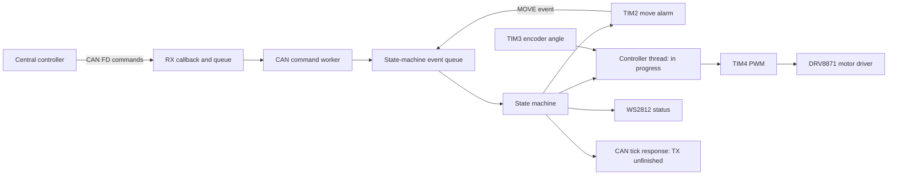

# STM32 Motor Controller — Zephyr RTOS

An embedded motor-driver firmware project for the **STM32 Nucleo-G431KB**, exploring CAN FD commands, timer-driven coordination, encoder feedback, and PWM actuation with Zephyr RTOS.

**Development status: in progress.** Peripheral interfaces and event-processing paths are present, but integration is still incomplete. CANFD reception transmission is working. UART is a placeholder.

| Area | Hardware/ Peripheral Implementation |
| --- | --- |
| Platform | STM32G431KB / Nucleo-G431KB; Zephyr C application |
| Motor interface | PWM on TIM4 channels 1 and 2 controlling DRV8871 motor driver|
| Feedback | Quadrature encoder angular readout |
| Communication | CAN FD configuration: 500 kbit/s arbitration, 2 Mbit/s data |
| Coordination | Queued state-machine events and motor alarms |
| Observability | Zephyr logging, heartbeat GPIO for timer and WS2812 status pixel for state-machine |
| Unit testing | Using ZTEST framework for state-machine transition testing |

## Architecture

The design moves command processing out of the CAN receive callback into a worker thread. A separate event consumer coordinates actions, while motor control has its own thread. Static buffers and stacks avoid application-side dynamic allocation but currently limit the design to one state-machine instance. Event payload pointers are borrowed; their lifetime and reuse remain an integration concern.
