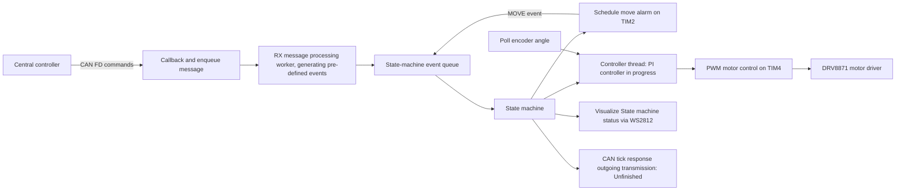

# STM32 Motor Controller — Zephyr RTOS

A motor-driver firmware project for the **STM32 Nucleo-G431KB** exploring CAN FD communication, real-time coordination, state machine implementation, and PID motor control.

**Development status: in progress.** Peripheral interfaces and event-processing paths are present, but integration is still incomplete. CANFD reception transmission is working.

## Development Progress
| Module | Status |
| --- | --- |
| CAN | :hourglass_flowing_sand: In Progress |
| | <table>  <thead>  <tr>  <th>Feature</th>  <th>Status</th>  </tr> </thead>  <tbody>  <tr>  <td>Sending & Receiving with BRS</td>  <td>:white_check_mark: Completed</td>  </tr>  <tr> <td>Acceptance Filtering</td>  <td>:white_check_mark: Completed</td>  </tr> <td>Adding & Retrieving messages to & from kmsgq</td>  <td>:white_check_mark: Completed</td>  </tr>  <tr>  <td>Integration with State Machine</td>  <td>:hourglass_flowing_sand: In Progress</td>  </tr>  </tbody>  </table> |
| State Machine | :hourglass_flowing_sand: In Progress |
| | <table>  <thead>  <tr>  <th>Feature</th>  <th>Status</th>  </tr>  </thead>  <tbody>  <tr>  <td>Full state transition matrix</td>  <td>:hourglass_flowing_sand: In Progress</td>  </tr>  <tr>  <td>State entry & exit functions</td>  <td>:hourglass_flowing_sand: In Progress</td>  </tr> </tbody>  </table> |
| PID Controller | :hourglass_flowing_sand: In Progress |
| | <table>  <thead>  <tr>  <th>Feature</th>  <th>Status</th>  </tr>  </thead>  <tbody>  <tr>  <td>Dedicated high priority thread</td>  <td>:white_check_mark: Completed</td>  </tr>  <tr>  <td>Integral windup & threshold clamp</td>  <td>:white_check_mark: Completed</td>  </tr> <td>Controller Tuning</td>  <td>:hourglass_flowing_sand: In Progress</td>  </tr> </tbody>  </table> |
| PWM Actuation | :hourglass_flowing_sand: In Progress |\
| | <table>  <thead>  <tr>  <th>Feature</th>  <th>Status</th>  </tr>  </thead>  <tbody>  <tr>  <td>CLKW, CCLKW and Brake signals</td>  <td>:white_check_mark: Completed</td>  </tr> <td>PID Integration</td>  <td>:hourglass_flowing_sand: In Progress</td>  </tr> </tbody>  </table> |
| QDEC Readout | :hourglass_flowing_sand: In Progress |
| | <table>  <thead>  <tr>  <th>Feature</th>  <th>Status</th>  </tr>  </thead>  <tbody>  <tr>  <td>Angular displacement readout</td>  <td>:white_check_mark: Completed</td>  </tr> <td>PID Integration</td>  <td>:hourglass_flowing_sand: In Progress</td>  </tr> </tbody>  </table> |
| WS2812 Status RGB | :white_check_mark: Completed |

## System Overview

| Area | Details |
| --- | --- |
| Platform | STM32G431KB / Nucleo-G431KB; Zephyr C application |
| Motor interface | PWM on TIM4 channels 1 and 2 controlling DRV8871 motor driver|
| Feedback | Quadrature encoder angular readout |
| Communication | CAN FD configuration: 500 kbit/s arbitration, 2 Mbit/s data |
| Coordination | Queued state-machine events and motor alarms |
| Observability | Zephyr logging, heartbeat GPIO for timer and WS2812 status pixel for state-machine |
| Unit testing | Using ZTEST framework for state-machine transition testing |
| Debugging | Zephyr logging, OpenOCD + GDB, DMM, Oscilloscope |

## Architecture



Received CAN RX messages are added onto a message queue to which an RX processing thread dequeues and generates relevant events onto a separate event processing message queue. State machine consumes new events posted on this event queue and transitions into the appropriate state, executing relevant state actions through entry and exit functions. Motor control performed in a dedicated high-priority thread, polling angular displacement of the DC motor through QDEC, calculating the actuation signal through an angular velocity PID controller and actuating the DRV8871 module through the PWM peripheral. 

## Hardware configuration

| Peripheral | Pins / configuration |
| --- | --- |
| TIM4 PWM | PB6 / channel 1, PB7 / channel 2; pull-ups, inverted polarity in code |
| TIM3 encoder | PA6 / channel 1, PA7 / channel 2; mode 3; 2448 counts/revolution |
| CAN FD | PA11 RX, PA12 TX; external transceiver and suitable bus termination required |
| TIM2 heartbeat | PA4 GPIO; intended 1 s toggle interval |
| SPI WS2812 | PB3 SCK, PB5 MOSI; one pixel, state colors at 10% brightness |

The encoder's configurations are set to 12 pulses/revolution, a 51:1 gear ratio, and quadrature x4 counting. 

## CAN command format

The logical payload uses 11 bytes in a **12-byte CAN FD frame**:

| Byte offset | Width | Meaning |
| --- | --- | --- |
| 0 | 1 | Payload target: local ID `0x65` or broadcast `0xFF` |
| 1–2 | 2 | Action characters |
| 3–6 | 4 | Action data; move uses big-endian float bits for rad/s |
| 7–10 | 4 | Big-endian target counter ticks |
| 11 | 1 | Padding for DLC of 9 = 12 bytes |

## Repository map

```text
src/
  main.c                 Component initialization and error polling
  CAN/                   CAN FD callbacks and workers
  STATE_MACHINE/         Event processing and controller thread
  PID/                   Fixed-point P/I arithmetic **In Progress**
  PWM/                   Motor-output mapping and channel control **In Progress**
  QDEC/                  Encoder angle API **In Progress**
  TIMER/                 TIM2 ticks, heartbeat, and move alarms
  STAT_RGB/              State-to-color indication
  TASK_WATCHDOG/         Software watchdog integration
  DRIVER_CONFIG/         CAN and controller constants
  UART/                  Placeholder, excluded from build
  PD_CONTROLLER/         Earlier experiment, excluded from build
tests/state_machine/     Zephyr ztest/FFF QEMU backed unit tests **In Progress**
```
