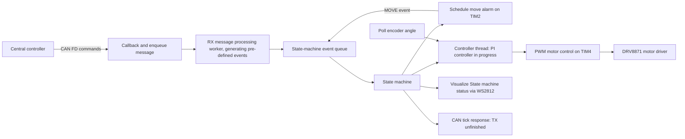

# STM32 Motor Controller — Zephyr RTOS

An embedded motor-driver firmware project for the **STM32 Nucleo-G431KB**, exploring CAN FD commands, timer-driven coordination, encoder feedback, and PWM actuation with Zephyr RTOS.

**Development status: in progress.** Peripheral interfaces and event-processing paths are present, but integration is still incomplete. CANFD reception transmission is working. UART is a placeholder.

| Area | Hardware/ Peripheral Implementation |
| --- | --- |
| Platform | STM32G431KB / Nucleo-G431KB; Zephyr C application |
| Motor interface | PWM on TIM4 channels 1 and 2 controlling DRV8871 motor driver|
| Feedback | Quadrature encoder angular readout |
| Communication | CAN FD configuration: 500 kbit/s arbitration, 2 Mbit/s data |
| Coordination | Queued state-machine events and motor alarms |
| Observability | Zephyr logging, heartbeat GPIO for timer and WS2812 status pixel for state-machine |
| Unit testing | Using ZTEST framework for state-machine transition testing |
| Debugging | Zephyr logging, OpenOCD + GDB, DMM, Oscilloscope |

## Architecture

Received CAN RX messages are added onto a message queue to which an RX processing thread dequeues and generates relevant events onto a separate event processing message queue. State machine consumes new events posted on this event queue and transitions into the appropriate state, executing relevant state actions through entry and exit functions. Motor control performed in a dedicated high-priority thread, polling angular displacement of the DC motor through QDEC, calculating the actuation signal through an angular velocity PID controller and actuating the DRV8871 module through the PWM peripheral. 
